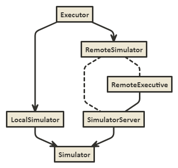
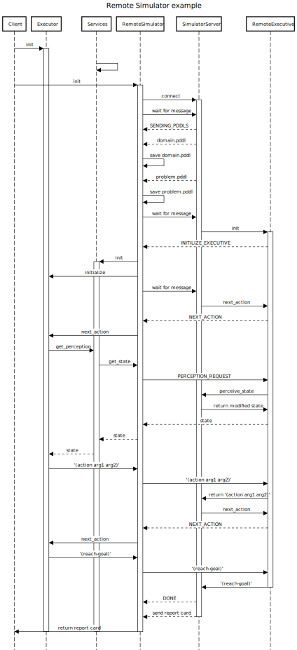

# Structure overview
- docs/ - auto generated docs
- domains/ - a collection of domains used for testing
- lapkt/ - pddlsim uses a modified version of LAPKT for efficent successor generation
    - LAPKT-dev/ - this is a git submodule contains lapkt source code
    - succ-gen/ - contains additional source code that is compiled for with LAPKT, this is necessary for successor generation.
    - build_lib.sh - downloads the lapkt source code, build the dependencies for succ_gen and also constructes the liblapkt library
- pddlsim/ - this is what you get when you install the package
    - executors/ - some executives you can use or extend
    - external/ - code used from other sources:
          - the compiled lapkt library
          - fd parser (also copied from LAPKT)
          - siw-then-bfsf planner (from planning.domains)
    - remote/ - package for using sockets to run a simulator server and executive client, we use this to better profile executive only performance
    - services/ - api's that the simulator manages and that executive can use, this includes generating sub-problems, perception, tracking goals, and querying for valid actions
    - utils/
        - planner.py - util for planning, supports using a local planner or an API call
        - valid_actions.py - python functions for finding valid actions
    - fd_parser.py - wrapper around fd_parser to convert to format used in simulator
    - local_simulator.py - use this to run a non-remote simulator 
    - parser_independent.py - this is the abstraction used in the simulator, 
    
    - simulator.py - base simulator - used by both local and remote simulators
- tests/ - a set of test to ensure everything is working, use pytest to run them
- tools/ - some useful tools for generating problems or running a remote server
- setup.py - run 'python setup.py bdist_wheel' to create a wheel for this library

# Simulator
The simulator itself is quite simple, it holds the true state of the world. This by itself is of no use to the executors, they need methods to query some view of the true world.
This is where services come in.
Both the LocalSimulator and RemoteSimulator are wrappers around the Simulator, but they also expose the services to the executive.

# Remote Protocol

No changes to the simulator or executor are required to be able to be run remotely. This is done by abstracting the simulator and executor into remote versions; RemoteSimulator and RemoteExecutive. An executor uses the same API with the RemoteSimulator. And on the other end of line, a standard simulator will be using a RemoteExecutive.

The communication itself uses sockets to send a message to update the other side regarding the state of the simulation (not the state of the environment), and then expecting the appropriate response. 



## Overview of the protocol

1. Client connects to server
2. Synchronize on PDDL files
If the server is running with preconfigured PDDL files, they will be sent to the client.
Otherwise the server will request PDDL files from the client
3. Server tells client to initialize
4. Client sends actions, or requests perception
After initializing, the server will be waiting for the next action from the client. This will be the string in the "(action-name param1 param2)" format.
Also the client can send a request for a perception of the current state. The server will then send a copy (modified if necessary) to the client.
5. Upon finishing the simulation, the server will send a done message and the a copy of the report card to the client

## Example



# Services
These are exposed to the executor so that they can figure out more about what's going on.
```simulator_services.py``` is the module used to setup the services.
The ```LocalSimulator``` and ```RemoteSimulator``` are responsible for setting this up, and passing it to the executor in the ```initialize``` method.

Some of them are updated on every action, by being subscribed to ```on_action_observers```.
It's best to avoid adding more of these, as they are exposed to all executors.

# Parsing
Parsing of the PDDL files isn't done directly by this project.
Instead we rely on the parsing from ```external.fd```.
However this project doesn't depend exclusively on that format of parsing.
The purpose of ```parser_independant.py``` is to define the parser independent format of the PDDL.
The conversion from the FD format of parsing to the parser independent one happens in ```fd_parser.py```.
This allows use to switch parsers if necessary, but this would require supporting our custom syntax in that new parser.
Adding a new syntax will require changes in all 3 stages.

## Format of state and actions
The state of the environment is represented as a simple dictionary.
The keys are all the predicates defined by the ```domain.pddl```.
The value is a set of all true argument to that predicate
This allows a O(1) operation to check if a predicate is true.

Action are made up of 3 things parameters, preconditions, and effects.
Parameters are just names for the position of the objects in preconditions and effect.
Preconditions are predicates that must be true to be able to apply the action.
They are different from conditions because they support arguments.
These preconditions should already be decomposed into only one list of predicates (and not nested conditions).
Effects are the changes to environment due to the action.
Here we separate the effect into 2; an add list and a delete list.
The add list is a list of predicates that must be added.
And the delete list is a list of predicates that must be deleted.

# Easy reinstall

Run ```./reinstall.sh``` to uninstall the current version of pddlsim, then build a wheel from the current source and install it. This is very useful for testing changes to the library.

# Release

To upload a new version to PyPi:
1. Don't forget to update the version in ```setup.py``` 
2. Build the wheel with ```python setup.py bdist_wheel```
3. Upload the wheel with twine: ```twine upload dist/$(ls dist -t | head -n1)```
